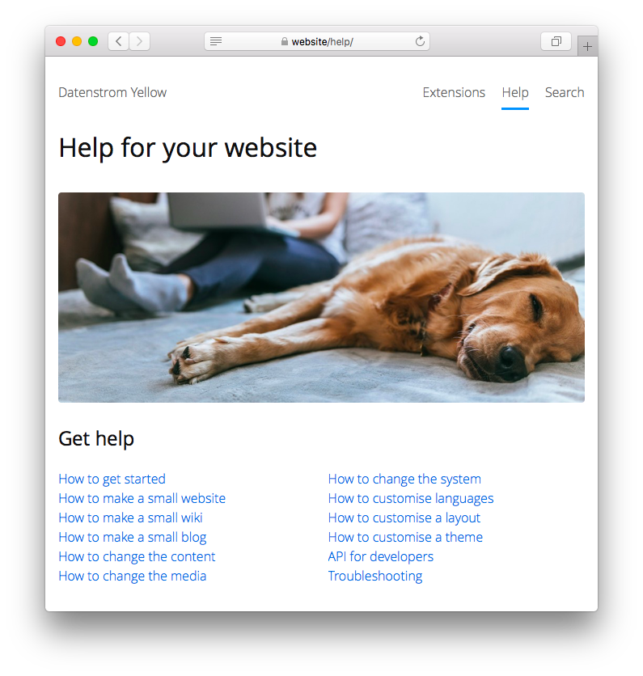

<a href="README-de.md">Deutsch</a> &nbsp; <a href="README.md">English</a> &nbsp; <a href="README-sv.md">Svenska</a>

# Help 0.9.6

Help for your website.

## How to install an extension

[Download ZIP file](https://github.com/annaesvensson/yellow-help/archive/refs/heads/main.zip) and copy it into your `system/extensions` folder. [Learn more about extensions](https://github.com/annaesvensson/yellow-update).

## How to use the help

The help is available on your website as `http://website/help/`. The help shows you how to make small websites, wikis and blogs. Here you will find instructions on how to customise your website. For developers there are descriptions of files, folders and what can be done with the API. It's recommended to install the [highlight extension](https://github.com/annaesvensson/yellow-highlight), [search extension](https://github.com/annaesvensson/yellow-search), [toc extension](https://github.com/annaesvensson/yellow-toc) together with the help extension. Then you will have the same package as the [help on the official website](https://datenstrom.se/yellow/help/). 

## How to improve the help

You can improve the help if something is wrong or missing. Install the help on your website, then you can make some changes and review the help from the perspective of the user. If you want to edit the help in a [web browser](https://github.com/annaesvensson/yellow-edit), you can do this on your website at `http://website/edit/help/`. If you want to edit the help on your [computer](https://github.com/annaesvensson/yellow-core), have a look inside your `content/9-help` folder. Did you improve the help? Fork this repository. Upload your changes and create a pull request for the repository `annaesvensson/yellow-help`.

## How to improve documentation

You can find cross-topic documentation in the help and more detailed documentation in [extensions](https://datenstrom.se/yellow/extensions/). Typically the documentation of an extension consists of multiple sections, with examples to copy/paste and settings you can customise. Review the entire documentation from the perspective of the user. Imagine what the user wants to do and what would make their life easier. Did you improve documentation? Fork the relevant repository. Upload your changes and send a pull request to the developer.

## Acknowledgements

This extension includes a photo by Bruno Cervera. Thank you for the beautiful photo.

## Developer

Anna Svensson. [Get help](https://datenstrom.se/yellow/help/).
