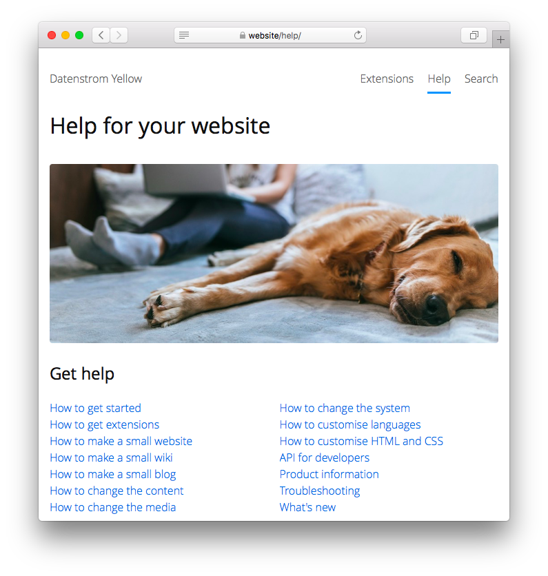

# Help 0.9.10

Dokumentation der Grundlagen. Entwickelt von Anna Svensson.

## Wie man eine Erweiterung installiert

[ZIP-Datei herunterladen](https://github.com/annaesvensson/yellow-help/archive/refs/heads/main.zip) und in dein `system/extensions`-Verzeichnis kopieren. [Weitere Informationen zu Erweiterungen](https://github.com/annaesvensson/yellow-update/tree/main/readme-de.md).

## Wie man die Hilfe benutzt

Die Hilfe ist auf deiner Webseite vorhanden als `http://website/help/`. Die Hilfe zeigt dir wie man kleine Webseiten, Wikis und Blogs macht. Hier findest du Anleitungen wie du deine Webseite anpasst in Englisch, Deutsch und Schwedisch. Für Entwickler gibt es Beschreibungen von Dateien, Verzeichnissen und was man mit der API machen kann. Es wird empfohlen die [Highlight-Erweiterung](https://github.com/annaesvensson/yellow-highlight/tree/main/readme-de.md), [Search-Erweiterung](https://github.com/annaesvensson/yellow-search/tree/main/readme-de.md), [Toc-Erweiterung](https://github.com/annaesvensson/yellow-toc/tree/main/readme-de.md) zusammen mit der Hilfe-Erweiterung zu installieren. Dann hast du das selbe Paket wie die [Hilfe auf der offiziellen Webseite](https://datenstrom.se/de/yellow/help/).

## Wie man die Hilfe verbessert

Du kannst die Hilfe verbessern falls etwas nicht stimmt oder fehlt. Installiere die Hilfe auf deiner Webseite, dann kannst du Änderungen machen und die Hilfe aus der Perspektive des Benutzers überprüfen. Falls du die Hilfe im [Webbrowser](https://github.com/annaesvensson/yellow-edit/tree/main/readme-de.md) bearbeiten möchtest, kannst du das auf deiner Webseite machen unter `http://website/edit/help/`. Falls du die Hilfe auf deinem [Computer](https://github.com/annaesvensson/yellow-core/tree/main/readme-de.md) bearbeiten möchtest, schau dir das `content/9-help`-Verzeichnis an. Für erfahrene Autoren gibt es einen [Styleguide](https://github.com/annaesvensson/yellow-help/blob/main/yellow-style-guide.md). Hast du die Hilfe verbessert? Mache ein Fork vom Repository `annaesvensson/yellow-help` und sende einen Pull-Request an den Entwickler.

## Wie man die Dokumentation verbessert

Du findest grundlegende Dokumentation in der Hilfe und ausführlichere Dokumentation in den [Erweiterungen](https://datenstrom.se/de/yellow/extensions/). Stell dir vor was der Benutzer machen möchte und was dessen Leben einfacher machen würde. Überprüfe die Dokumentation aus der Perspektive des Benutzers. Grundsätzlich sollte die Dokumentation aus mehreren Abschnitten bestehen, Beispiele enthalten welche die Benutzer kopieren/einfügen können und in einer leicht verständlichen Sprache geschrieben sein. Für erfahrene Autoren gibt es einen [Styleguide](https://github.com/annaesvensson/yellow-help/blob/main/yellow-style-guide.md). Hast du die Dokumentation verbessert? Mache ein Fork vom entsprechenden Repository und sende einen Pull-Request an den Entwickler.

## Danksagung

Diese Erweiterung enthält ein Foto von Bruno Cervera. Danke für das schöne Foto.

Hast du Fragen? [Hilfe finden](https://datenstrom.se/de/yellow/help/).
